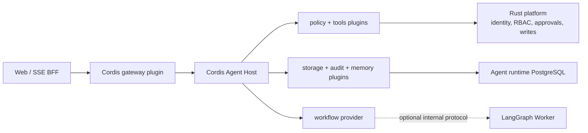

# YaYa Agent Architecture Decision Record

## Status

Accepted for the Agent refactor. This document describes YaYa Low Code, not the Mengnex reference project. Mengnex material is useful for component boundaries, but its media-library and synchronization examples are not product requirements here.

## Decision

Cordis is the Agent host and plugin microkernel. LangGraph is the preferred implementation candidate for durable, interruptible workflow execution after it is deployed as an independent Agent-domain worker. It is not embedded in Rust and it is not embedded in the Node.js process.

The default `workflow-engine` remains the local Node provider while the LangGraph worker is introduced. A `workflow-client` provider may replace it through `agent/config/plugins.json` without changing the Cordis Host. Only one provider may expose the `workflow` service.

## Boundaries

| Boundary | Owner | Rule |
| --- | --- | --- |
| Plugin lifecycle and composition | Cordis | Services expose contracts through `ctx`; plugins cannot reach another plugin implementation directly. |
| Reasoning state machine | workflow provider | The default Node provider and an external LangGraph provider are interchangeable implementations of `workflow`. |
| Tool invocation and approval | Cordis policy/tools + Rust platform | A workflow can propose a tool call but cannot execute platform writes directly. |
| Identity, permissions, tenancy, domain transactions | Rust platform | Platform validates user authority at every domain boundary. |
| Sessions, runs, steps, memory | storage provider | PostgreSQL is the production provider; JSON is development-only. |
| HTTP and SSE compatibility | gateway plugin | The gateway translates protocol only and never embeds business authorization. |

## LangGraph Worker Protocol

The worker is an internal service, not a public browser endpoint. The Cordis `workflow-client` must send an authenticated workload envelope containing `runId`, `sessionId`, stable principal identity, route context, token/time budgets, prior checkpoint reference, messages, and the enabled tool manifests.

The worker receives an authenticated workload envelope containing message history, enabled tool manifests, token budget and stable non-secret identity context. It returns model output and tool proposals to the Cordis Host for policy enforcement and execution. The current worker uses restricted PostgreSQL credentials only for LangGraph checkpoints; it does not receive the user's bearer token, unrestricted network access, or authority to call Rust write APIs.

Approval pauses retain an Agent storage checkpoint containing the run, message state, iteration and platform pending-action ID. Once the platform confirms an action, the selected workflow provider continues the same run from that checkpoint. The LangGraph worker is called with the same run ID, which scopes its checkpoint thread; tool policy and final writes remain in Cordis and Rust respectively.

## Technology Selection

LangGraph is selected as the first external workflow engine to evaluate because its graph state, checkpoint and interrupt model fit long-running, approval-gated Agent work. This is a project decision, not a claim that it is the default framework for every Agent workload.

Before switching the default provider, benchmark the Node provider and LangGraph worker using the same representative workloads: form design, schema editing, automation drafting, read-only exploration, approval pause/resume, cancellation, and recovery after worker restart. Capture latency, token use, tool error rate, checkpoint recovery success, operational cost, and trace completeness. Do not carry over Mengnex or third-party token multipliers as project facts.

## Scope and Deferrals

Phase one is one Agent with multiple least-privilege tools, durable runs, audit records, recoverable approval and provable platform permissions.

MCP is an optional tool-provider adapter once an external integration needs it. A2A is deferred until there is a concrete second-agent ownership boundary. LangSmith or another observability backend is optional after the local run/step audit schema is insufficient. None of these are required to start the Agent service.

## Mengnex Reference Mapping

| Mengnex reference term | YaYa Low Code equivalent |
| --- | --- |
| media service/library | application, form, record, automation and navigation services |
| media synchronization | approval-gated platform write workflow |
| local media memory | tenant/user-scoped platform work memory |
| media worker | independently deployed Agent workflow worker |
