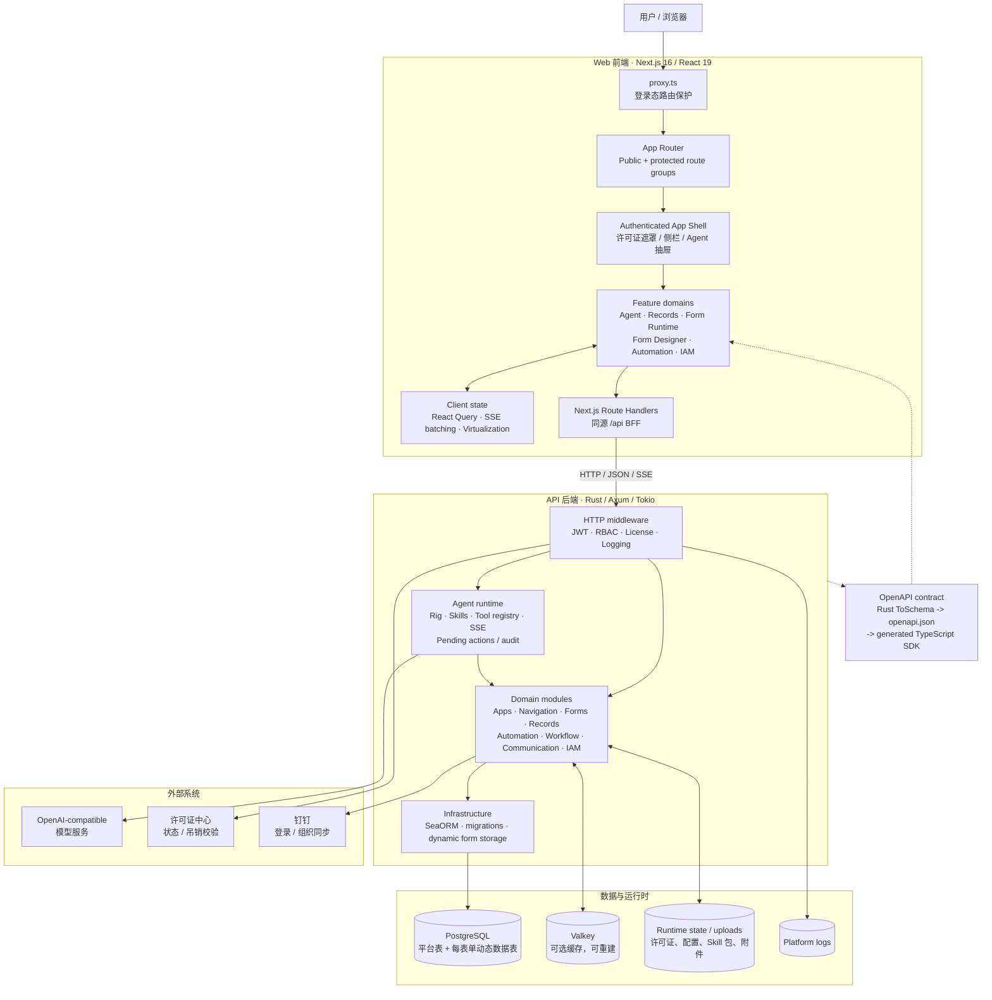

# 系统架构

本文档描述当前仓库实际运行边界。浏览器只访问 Next.js 同源地址；除服务端页面直接读取外，业务 API 由 Next.js Route Handler 转发到 Rust API。Rust 服务负责许可证、认证授权、领域规则、Agent 工具执行和数据持久化。

## 请求路径

1. 页面请求先经过 `web/proxy.ts`，公开登录页与受保护路由在这里分流。
2. 受保护布局装配认证、许可证状态和应用壳；领域组件通过 `web/features/` 中的 Hook 或 API 入口访问服务端状态。
3. 浏览器请求同源 `/api/*` Route Handler。BFF 转发认证信息到默认位于 `127.0.0.1:8787` 的 Axum 服务，避免浏览器直接持有后端地址和内部令牌。
4. Axum 中间件先执行许可证、JWT、RBAC 和日志处理，再进入领域模块。Agent 消息使用 SSE 返回增量事件，写操作通过待确认动作执行。
5. SeaORM 访问 PostgreSQL；表单元数据保存在平台表，发布后的记录使用按表单创建的动态物理表。Valkey 只承担可重建缓存，附件和本地配置位于运行时状态目录。

## 契约边界

- 后端请求与响应 DTO 使用 `ToSchema`，由 `api/src/openapi.rs` 导出 `api/openapi/openapi.json`。
- `@hey-api/openapi-ts` 生成 `web/app/lib/api-client/`，前端领域 API 再从生成客户端选择性导出。
- 新接口必须同时具备 Axum 路由、OpenAPI endpoint 和对应 Next.js BFF Route Handler；缺少最后一层时，浏览器同源请求会在 Next.js 返回 404。

## 部署边界

- 开发环境通常分别运行 Next.js `:3000`、Axum `:8787`、PostgreSQL 和可选 Valkey。
- 单容器部署由进程管理器同时运行 Web 与 API，并连接独立 PostgreSQL、Valkey 服务和持久化 `api-state` 卷。
- PostgreSQL 与 `api-state` 是必须成对备份的客户数据；Valkey 仅存缓存，不作为恢复来源。
